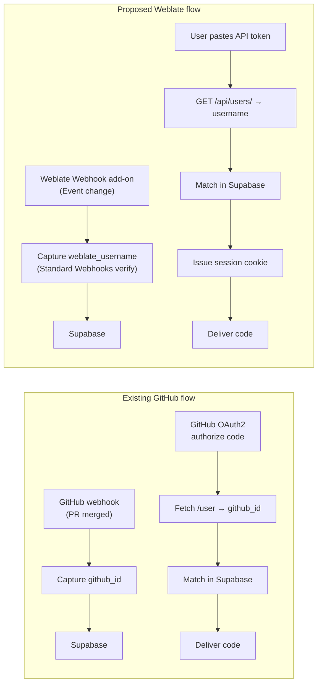

# Replicating the GitHub Reward Flow for Hosted Weblate — Implementation Plan

Before diving in, one critical correction must be stated up front, because it changes the shape of Step 2 entirely: **Hosted Weblate (hosted.weblate.org) is not an OAuth2 *provider*.** Weblate ships no `django-oauth-toolkit`, exposes no `/oauth/authorize/` or `/oauth/token/` endpoints, and has no "Register an OAuth Application" UI. The `SOCIAL_AUTH_*_OAUTH2_*` settings in Weblate's configuration are for Weblate acting as a *client* (relying party) of GitHub/Google/GitLab — i.e. "Log *into* Weblate with GitHub" — not the reverse.【turn25fetch0】【turn22fetch0】【turn20fetch0】 The official REST API documents only one authentication method: a personal API token sent as `Authorization: Token <token>`.【turn5find1】【turn16find1】

So the reward mechanism you want *is* fully replicable, but the identity-confirmation half is an **API-token verification flow**, not an OAuth2 authorization-code flow. The webhook half maps almost 1:1 with your GitHub setup. The rest of this plan is built around that reality, with every endpoint and payload field drawn from the official Weblate docs.

---

## 1. Architecture Overview

Both flows share the same three-phase shape — **capture identity on contribution → confirm identity at login → gate the reward** — but the *identifier* and the *confirmation mechanism* differ.

| Aspect | Existing GitHub flow | Proposed Weblate flow |
|---|---|---|
| Contribution trigger | PR-merged GitHub webhook | Weblate **Webhook add-on** (`weblate.webhook.webhook`) on "Event change"【turn10find0】 |
| Identifier captured | GitHub user numeric ID | Weblate **username** (string), from the payload `author` / `user` field【turn11fetch0】 |
| Webhook authenticity | HMAC signature from GitHub secret | **Standard Webhooks** HMAC-SHA256 with `webhook-id`/`webhook-timestamp`/`webhook-signature` headers + base64 `secret`【turn11fetch0】 |
| Login confirmation | OAuth2 authorization code (`/login/oauth/authorize`) | **API token verification** — user pastes a personal Weblate API token; backend calls `GET /api/users/` to read their own profile【turn13find0】 |
| Identity match key | `github_id` column | `weblate_username` column (case-sensitive, exact match) |
| Supabase role | Pure DB (Drizzle + Hyperdrive) | Identical |
| Frontend | Vanilla JS | Identical |



**Identity matching** is the keystone of the design: the *same string* (the Weblate username) is written by the webhook handler and read back by the token-verification handler. `GET /api/users/` with a non-admin token returns "only your own details", so the username returned by that call is cryptographically trustworthy (it is vouched for by Weblate having issued a working token for that account).【turn13find0】

---

## 2. Weblate Setup & Documentation References

All references below are to the *current* official Weblate documentation (2026.7).

- **Webhook add-on** — `weblate.webhook.webhook`, added in 5.11. Triggers on "Event change", follows the Standard Webhooks spec, payload complies with the Weblate Messaging schema (OpenAPI at `/api/docs/`).
  https://docs.weblate.org/en/latest/admin/addons.html#webhook【turn10find0】【turn11fetch0】
- **REST API reference** — base URL `https://hosted.weblate.org/api/`, Django REST Framework, token auth via `Authorization: Token <token>`.
  https://docs.weblate.org/en/latest/api.html【turn0search0】
- **Authentication & generic parameters** (token format, `wlu_` prefix, project-scoped tokens).
  https://docs.weblate.org/en/latest/api.html#authentication-and-generic-parameters【turn5find1】
- **`GET /api/users/`** — returns the caller's own profile when they lack user-management permissions (this is the identity endpoint).
  https://docs.weblate.org/en/latest/api.html#get--api-users-【turn13find0】
- **API rate limiting** — 100 req/day anonymous, 5000 req/hour authenticated; headers `X-RateLimit-Limit`, `X-RateLimit-Remaining`, `X-RateLimit-Reset`.
  https://docs.weblate.org/en/latest/api.html#api-rate-limiting【turn5find0】
- **Authentication backends** (explains that Weblate's OAuth2 settings are *inbound* social auth, not an outbound provider).
  https://docs.weblate.org/en/latest/admin/auth.html【turn0search9】
- **Registration and user profile** — where users generate their personal API token.
  https://docs.weblate.org/en/latest/user/profile.html【turn6search6】
- **Standard Webhooks specification** (signature algorithm referenced by the add-on).
  https://github.com/standard-webhooks/standard-webhooks【turn11fetch0】

---

## 3. Step 1 — Tracking Translations (Webhooks)

### 3.1 Configure the add-on on Hosted Weblate

On Hosted Weblate the add-on is installed per project (or per component) from **Manage → Add-ons → Webhook** (site-wide installation is also possible through the Management interface).【turn10find0】 Configure:

| Field | Value |
|---|---|
| `webhook_url` | `https://<your-pages-domain>/api/weblate-webhook` |
| `secret` | A random ≥32-byte base64 string (you generate this; store it in Cloudflare as `WEBLATE_WEBHOOK_SECRET`). You may prefix it with `whsec_`. |
| `events` | Select **all change events** that represent a contribution: at minimum *New translation*, *Translation changed*, *Suggestion added*, *Suggestion accepted*, *Marked for edit*, *Comment added*. Selecting every available event is the safe way to capture "any contribution". |

Install the add-on at the **project** level so every component underneath fires the same hook.

### 3.2 The payload you will receive

Sample body from the docs (note `author` and `user`):【turn11fetch0】

```json
{
  "change_id": 99,
  "action": "Translation changed",
  "timestamp": "2019-08-24T14:15:22Z",
  "target": "Nazdar svete!",
  "old": "Nazdar!",
  "source": "Hello, world",
  "url": "/translate/project-slug/component-slug/cs/?checksum=46add148a53cab6f",
  "author": "author-username",
  "user": "user-username",
  "project": "project-slug",
  "component": "component-slug",
  "translation": "cs"
}
```

`author` is the Weblate username credited for the change; `user` is the user who triggered the event. For a contribution-reward scheme, **`author`** is the correct key (it is the translator being credited). Both are plain Weblate usernames — exactly what `GET /api/users/` returns in Step 2.

Headers carry the Standard Webhooks signature:【turn11fetch0】

```
webhook-id: 7f1c5477f6275a69af7b83236c20cb1a
webhook-timestamp: 1748505623.044281
webhook-signature: v1,Ceo5qEr07ixe2NLpvHk3FH9bwy/WavXrAFQ/9tdO6mc=
```

### 3.3 Drizzle schema (shared by both flows)

```javascript
// schema.ts
import { pgTable, text, timestamp, boolean, index } from 'drizzle-orm/pg-core';

export const rewardedTranslators = pgTable(
  'rewarded_translators',
  {
    weblateUsername: text('weblate_username').primaryKey(),
    firstContributionAt: timestamp('first_contribution_at', { withTimezone: true }).notNull(),
    lastContributionAt: timestamp('last_contribution_at', { withTimezone: true }).notNull(),
    contributionCount: text('contribution_count').notNull().default('0'),
    rewarded: boolean('rewarded').notNull().default(true),
  },
  (t) => ({
    usernameIdx: index('idx_weblate_username').on(t.weblateUsername),
  }),
);

// Session table for Step 2/3
export const sessions = pgTable('sessions', {
  id: text('id').primaryKey(),                 // random 32-byte token
  weblateUsername: text('weblate_username').notNull(),
  createdAt: timestamp('created_at', { withTimezone: true }).notNull(),
  expiresAt: timestamp('expires_at', { withTimezone: true }).notNull(),
});
```

### 3.4 Webhook receiver — Cloudflare Pages Function

File: `functions/api/weblate-webhook.js`. Uses only Web Standard APIs (`Request`, `Response`, `crypto.subtle`, `atob`). Verifies the Standard Webhooks signature, rejects replays (>5 min), upserts the contributor.

```javascript
// functions/api/weblate-webhook.js
import { drizzle } from 'drizzle-orm/postgres-js';
import postgres from 'postgres';
import { rewardedTranslators } from '../../src/schema';

interface Env {
  HYPERDRIVE: Hyperdrive;            // Cloudflare Hyperdrive binding
  WEBLATE_WEBHOOK_SECRET: string;     // base64, optionally whsec_-prefixed
}

async function verifyStandardWebhook(
  body: string,
  headers: Headers,
  secretB64: string,
): Promise<boolean> {
  const msgId = headers.get('webhook-id');
  const ts = headers.get('webhook-timestamp');
  const sigHeader = headers.get('webhook-signature');
  if (!msgId || !ts || !sigHeader) return false;

  // Replay window
  const ageSec = Math.abs(Date.now() / 1000 - parseFloat(ts));
  if (ageSec > 300) return false;

  // Strip optional whsec_ prefix, decode base64 secret
  const cleanSecret = secretB64.startsWith('whsec_') ? secretB64.slice(6) : secretB64;
  const keyBytes = Uint8Array.from(atob(cleanSecret), (c) => c.charCodeAt(0));

  const key = await crypto.subtle.importKey(
    'raw', keyBytes, { name: 'HMAC', hash: 'SHA-256' }, false, ['sign'],
  );
  const signed = new TextEncoder().encode(`${msgId}.${ts}.${body}`);
  const mac = new Uint8Array(await crypto.subtle.sign('HMAC', key, signed));
  const expected = btoa(String.fromCharCode(...mac));

  return sigHeader
    .split(' ')
    .map((s) => s.trim())
    .some((s) => s.startsWith('v1,') && s.slice(3) === expected);
}

export const onRequestPost: PagesFunction<Env> = async ({ request, env }) => {
  const rawBody = await request.text();

  const ok = await verifyStandardWebhook(rawBody, request.headers, env.WEBLATE_WEBHOOK_SECRET);
  if (!ok) return new Response('invalid signature', { status: 401 });

  let payload: { action?: string; author?: string; user?: string };
  try {
    payload = JSON.parse(rawBody);
  } catch {
    return new Response('bad json', { status: 400 });
  }

  const username = payload.author ?? payload.user;
  if (!username) return new Response('no user', { status: 200 }); // ack non-user events

  const sql = postgres(env.HYPERDRIVE.connectionString, { max: 1 });
  const db = drizzle(sql);
  try {
    await db.insert(rewardedTranslators)
      .values({
        weblateUsername: username,
        firstContributionAt: new Date(),
        lastContributionAt: new Date(),
      })
      .onConflictDoUpdate({
        target: rewardedTranslators.weblateUsername,
        set: { lastContributionAt: new Date() },
      });
  } finally {
    await sql.end();
  }
  return new Response('ok', { status: 200 });
};
```

**Notes on the implementation choices:**
- `postgres-js` + `drizzle-orm/postgres-js` is the Drizzle adapter that runs natively on the Workers runtime over Hyperdrive's TCP socket (the `node-postgres` driver does *not* work in Workers). `max: 1` keeps each invocation lightweight; Hyperdrive pools the real connections.【turn25fetch0】
- The raw body is read once with `request.text()` and reused for both verification and parsing — signature verification must be over the *exact* bytes received.
- Always return `200` for well-formed events so Weblate does not retry indefinitely; return non-200 only on transient errors you *want* retried.

---

## 4. Step 2 — Authentication (Identity Confirmation)

### 4.1 Why this is not OAuth2, and what to do instead

A respectful but firm restatement of the constraint: there is no OAuth2 provider on Hosted Weblate to register an application against. Searching the live Weblate source confirms it — `pyproject.toml` lists `djangorestframework` but no `django-oauth-toolkit`, `accounts/urls.py` defines no `/oauth/` routes, and the API docs show only `Authorization: Token <token>`.【turn29fetch0】【turn22fetch0】【turn16find1】 Any plan that invents `/oauth/authorize/` or `/oauth/token/` URLs on hosted.weblate.org would be fiction.

The minimal, best-practice equivalent is an **API-token verification + server-issued session** flow:

1. The user generates a personal API token in their Weblate profile (Account → API key, tokens carry the `wlu_` prefix).【turn5find1】
2. On your site they paste the token into a form.
3. Your Pages Function calls `GET https://hosted.weblate.org/api/users/` with `Authorization: Token <token>`. Because a non-admin token returns "only your own details", the response is the user's own profile, including `username`.【turn13find0】
4. The Function matches that username against Supabase, and if eligible, mints its **own** session cookie. The Weblate token is discarded immediately — never stored.

This gives you the same security property OAuth2 gives you in the GitHub flow: *your server learns the user's identity, vouched for by the identity provider, without ever handling their password.* The user does hand your site a bearer token instead of going through a redirect — the trust implication is that the token grants API access to their account, so you must (a) use it once and discard it, and (b) be explicit with users that they can revoke it from their Weblate profile at any time.

### 4.2 CSRF and session design

Because there is no OAuth redirect, the classic `state`-parameter CSRF defense does not apply directly. The equivalent protections for a form-submit flow are:

- **Same-origin POST only**: the verify endpoint rejects any request whose `Origin` / `Referer` is not your own Pages domain.
- **Double-submit cookie**: set a random `_csrf` cookie (HttpOnly=false, SameSite=Lax) when serving the login page, require the same value in an `X-CSRF-Token` header on the POST.
- **Idempotent verification, server-issued session**: the verify endpoint does not authenticate the *request*; it only exchanges a Weblate token for a session. The session cookie it issues is `HttpOnly; Secure; SameSite=Lax` and backed by a row in the `sessions` table.
- **Replay protection for the Weblate token**: a token that has already been used to mint a session in the last N seconds is rejected, preventing a stolen-token replay burst.

### 4.3 Verify endpoint

File: `functions/api/verify-weblate.js`

```javascript
// functions/api/verify-weblate.ts
import { drizzle } from 'drizzle-orm/postgres-js';
import postgres from 'postgres';
import { rewardedTranslators, sessions } from '../../src/schema';

interface Env {
  HYPERDRIVE: Hyperdrive;
  SITE_ORIGIN: string;        // e.g. https://your-pages.pages.dev
  SESSION_TTL_SECONDS: string;
}

const HOSTED = 'https://hosted.weblate.org';

async function fetchOwnProfile(token: string) {
  const res = await fetch(`${HOSTED}/api/users/`, {
    headers: { Authorization: `Token ${token}`, Accept: 'application/json' },
  });
  if (!res.ok) return null;
  const data = await res.json() as { results?: { username: string }[]; username?: string };
  // Non-admin tokens get a single-object-or-paginated response of their own profile.
  return data.results?.[0]?.username ?? data.username ?? null;
}

function randomId(bytes = 32): string {
  const a = new Uint8Array(bytes);
  crypto.getRandomValues(a);
  return Array.from(a, (b) => b.toString(16).padStart(2, '0')).join('');
}

export const onRequestPost: PagesFunction<Env> = async ({ request, env }) => {
  const origin = request.headers.get('origin') ?? '';
  if (origin !== env.SITE_ORIGIN) return new Response('forbidden', { status: 403 });

  const csrfCookie = parseCookie(request.headers.get('cookie') ?? '', '_csrf');
  const csrfHeader = request.headers.get('x-csrf-token') ?? '';
  if (!csrfCookie || csrfCookie !== csrfHeader) return new Response('bad csrf', { status: 403 });

  const { token } = (await request.json()) as { token?: string };
  if (!token || !/^wlu_[A-Za-z0-9]+$/.test(token)) {
    return new Response('invalid token', { status: 400 });
  }

  const username = await fetchOwnProfile(token);
  if (!username) return new Response('weblate rejected token', { status: 401 });

  const sql = postgres(env.HYPERDRIVE.connectionString, { max: 1 });
  const db = drizzle(sql);
  try {
    const eligible = await db.select()
      .from(rewardedTranslators)
      .where(eq(rewardedTranslators.weblateUsername, username))
      .limit(1);
    if (eligible.length === 0) return json({ eligible: false }, 403);

    const sessionId = randomId(32);
    const now = new Date();
    const exp = new Date(now.getTime() + Number(env.SESSION_TTL_SECONDS) * 1000);
    await db.insert(sessions).values({
      id: sessionId, weblateUsername: username, createdAt: now, expiresAt: exp,
    });

    return json({ eligible: true }, 200, {
      'set-cookie': `sid=${sessionId}; HttpOnly; Secure; SameSite=Lax; Path=/; Max-Age=${env.SESSION_TTL_SECONDS}`,
    });
  } finally {
    await sql.end();
  }
};

// tiny helpers omitted for brevity: json(), parseCookie(), eq() from drizzle-orm
```

The Weblate token is used in a single `fetch` to `/api/users/` and then dropped — it never touches Supabase, never enters a cookie, never reaches the frontend again. From this point on, the user is authenticated purely by your own `sid` session cookie.

```mermaid
sequenceDiagram
  participant U as User (browser)
  participant F as Frontend (HTML/JS)
  participant P as Pages Function /api/verify-weblate
  participant W as hosted.weblate.org /api/users/
  participant S as Supabase (Drizzle+Hyperdrive)
  U->>F: paste Weblate API token
  F->>P: POST {token} + X-CSRF-Token (from _csrf cookie)
  P->>P: check Origin, CSRF, token shape
  P->>W: GET /api/users/  Authorization: Token <token>
  W-->>P: { username: "alice" }
  P->>S: SELECT FROM rewarded_translators WHERE weblate_username = 'alice'
  S-->>P: row exists
  P->>S: INSERT INTO sessions (id, username, exp)
  P-->>F: 200 Set-Cookie: sid=...; HttpOnly; Secure
  Note over P,W: Weblate token discarded — never persisted
```

### 4.4 Frontend (vanilla JS)

```html
<!-- login.html -->
<form id="wl-login">
  <input name="token" type="password" placeholder="Weblate API token (wlu_…)" required />
  <button type="submit">Unlock code</button>
</form>
<p id="msg"></p>

<script>
  // _csrf cookie was set server-side when this page was rendered.
  const csrf = (document.cookie.match(/(?:^|;\s)_csrf=([^;]+)/) || [])[1] ?? '';
  document.getElementById('wl-login').addEventListener('submit', async (e) => {
    e.preventDefault();
    const fd = new FormData(e.target);
    const res = await fetch('/api/verify-weblate', {
      method: 'POST',
      headers: { 'Content-Type': 'application/json', 'X-CSRF-Token': csrf },
      body: JSON.stringify({ token: fd.get('token') }),
    });
    if (res.ok) {
      location.href = '/code.html';
    } else {
      document.getElementById('msg').textContent =
        res.status === 403 ? 'No translations found on your Weblate account yet.' : 'Verification failed.';
    }
  });
</script>
```

---

## 5. Step 3 — Verification & Code Delivery

The reward itself is served by a guarded endpoint that validates the `sid` cookie, looks up the username, confirms eligibility again (defense in depth — a contributor could have been removed between login and code fetch), and returns the restricted payload.

File: `functions/api/code.js`

```javascript
// functions/api/code.ts
import { drizzle } from 'drizzle-orm/postgres-js';
import postgres from 'postgres';
import { rewardedTranslators, sessions } from '../../src/schema';
import { and, eq, gt } from 'drizzle-orm';

interface Env {
  HYPERDRIVE: Hyperdrive;
  RESTRICTED_CODE: string;   // the secret payload, in a Cloudflare secret
}

export const onRequestGet: PagesFunction<Env> = async ({ request, env }) => {
  const sid = parseCookie(request.headers.get('cookie') ?? '', 'sid');
  if (!sid) return new Response('unauthorized', { status: 401 });

  const sql = postgres(env.HYPERDRIVE.connectionString, { max: 1 });
  const db = drizzle(sql);
  try {
    const session = await db.select()
      .from(sessions)
      .where(and(eq(sessions.id, sid), gt(sessions.expiresAt, new Date())))
      .limit(1);
    if (session.length === 0) return new Response('unauthorized', { status: 401 });

    const username = session[0].weblateUsername;

    // Re-check eligibility at delivery time
    const eligible = await db.select()
      .from(rewardedTranslators)
      .where(eq(rewardedTranslators.weblateUsername, username))
      .limit(1);
    if (eligible.length === 0) return new Response('forbidden', { status: 403 });

    return json({ code: env.RESTRICTED_CODE, forUser: username }, 200, {
      'cache-control': 'no-store',
    });
  } finally {
    await sql.end();
  }
};
```

Key points:
- The `sid` cookie is `HttpOnly`, so the frontend cannot read it; the browser attaches it automatically to same-origin requests. The restricted code is delivered only as a JSON body to an authenticated, eligible request.
- `cache-control: no-store` prevents the restricted payload from being cached at the edge or in the browser.
- Eligibility is checked **twice** (at login and at delivery) so that revoking a contributor between those moments immediately cuts access.

---

## 6. Potential Pitfalls

**OAuth2 misconception.** The single biggest trap is assuming Hosted Weblate exposes `/oauth/authorize/` and `/oauth/token/`. It does not; treat any guide pointing you there as inaccurate. The API-token flow above is the supported path.【turn29fetch0】【turn16find1】

**Webhook signature edge cases.** Standard Webhooks signs `${webhook-id}.${webhook-timestamp}.${rawBody}` with HMAC-SHA256 keyed by the *base64-decoded* secret, and the result is base64-encoded and prefixed with `v1,`. Two common mistakes: (a) HMAC-ing the JSON-parsed object instead of the raw bytes, (b) forgetting to strip the optional `whsec_` prefix before base64-decoding. Always verify over `await request.text()` consumed exactly once.【turn11fetch0】

**Replay window.** Enforce the `webhook-timestamp` freshness check (5 minutes is the Standard Webhooks recommendation); without it, an attacker who captures a single valid request can replay it indefinitely.

**Hyperdrive + Drizzle driver selection.** `drizzle-orm/node-postgres` does *not* run in the Workers runtime. Use `drizzle-orm/postgres-js` with `postgres(env.HYPERDRIVE.connectionString)`. Open one short-lived client per request (`max: 1`) and `await sql.end()` in a `finally` — Hyperdrive handles the real connection pooling behind the scenes.

**Workers runtime quirks.** `crypto.subtle` is async only; plan your signature verification accordingly. `atob`/`btoa` exist in Workers, but for large bodies prefer `TextEncoder`/`Uint8Array` to stay allocation-light. `Request.body` is a stream — once you call `request.text()` you cannot re-read it, so capture the string and reuse it.

**Rate limits.** Authenticated Weblate API requests are capped at 5000/hour, anonymous at 100/day.【turn5find0】 Your verification endpoint makes exactly one authenticated call per login attempt, so you will not approach the limit — but if you later add features that poll Weblate (e.g. contribution counts), respect `X-RateLimit-Remaining` and back off. Webhook delivery from Weblate is not rate-limited in the same way, but if your handler returns non-2xx, Weblate will retry; keep the handler fast and idempotent (the `onConflictDoUpdate` upsert makes it safe to process the same `change_id` twice).

**Token scope and user trust.** A Weblate personal API token grants read/write API access to the user's account — there is no read-only "identity" scope. Mitigate by (a) using the token for a single `/api/users/` call and discarding it, (b) never logging or persisting it, (c) telling users in the UI that they can revoke it from their Weblate profile immediately after unlocking the code. Project-scoped tokens exist but require project membership, so they are not a general identity-verification tool.【turn5find1】

**Username case sensitivity.** Weblate usernames are case-sensitive and the API returns them in canonical form. Store and compare them exactly as Weblate emits them — do not lowercase. The webhook `author` field and the `/api/users/` `username` field are produced by the same source, so they will match byte-for-byte.

**Cookie security on `*.pages.dev`.** Preview deployments share the `pages.dev` suffix; set `Secure` and validate `Origin` against `SITE_ORIGIN` so a preview URL cannot be used to phish tokens on behalf of the production site. Promote to a custom domain for production.

**Webhook add-on availability.** The Webhook add-on (`weblate.webhook.webhook`) was added in Weblate 5.11; Hosted Weblate always runs a recent release, so it is available, but verify in **Manage → Add-ons** that "Webhook" is listed before relying on it.【turn10find0】 The older "Notification hooks" / `ServiceHookView` are for *inbound* code-hosting notifications (GitHub/GitLab pushing to Weblate), not for outbound contribution events — do not confuse the two.【turn7find1】

---

### Summary of the design philosophy applied

The whole system is four Pages Functions (`weblate-webhook`, `verify-weblate`, `code`, and a tiny `login` page renderer), two Supabase tables, the `drizzle-orm` + `postgres-js` pair, and the Web Crypto API already built into Workers. No OAuth client library, no JWT library, no Node-only dependency. The webhook side is a near-exact port of your GitHub mechanism; the login side is adapted to the one identity primitive Hosted Weblate actually exposes — the personal API token verified against `GET /api/users/` — with a server-issued session restoring the same security posture your GitHub OAuth flow enjoys.
